<p align="center">
  
</p>

# Bluebird

> Static analysis CLI for NestJS projects

[](https://www.npmjs.com/package/bluebird-nestjs)
[](https://github.com/endpointclosing/bluebird/actions/workflows/test.yml)
[](https://codecov.io/gh/endpointclosing/bluebird)
[](https://www.typescriptlang.org/)
[](https://nodejs.org/)

## Stability

Bluebird is **production-ready** for NestJS static analysis. The project maintains:

- **944+ tests** with comprehensive coverage across 23 test files
- **95%+ line coverage** (statements, branches, functions)
- **Semantic versioning** for predictable upgrades
- **CI/CD integration** with SARIF output for code scanning
- **Active maintenance** with regular security updates

The API surface (`diagnose`, `runEslint`, `analyseFiles`, formatters) is stable. Breaking changes will only occur in major version bumps with migration guides.

Bluebird is a static analysis CLI for NestJS projects. It parses TypeScript source files, runs 38 purpose-built rules across architecture, security, performance, correctness, and API design, and produces a health score useful both locally and in CI.

## Why Bluebird?

NestJS projects can accumulate technical debt silently. Bluebird catches issues that generic linters miss:

- **Security issues** — Hardcoded secrets, SQL injection, missing validation pipes
- **Architectural problems** — Circular dependencies, god controllers/services, DI bypasses
- **Performance blockers** — Sync filesystem operations, blocking crypto, N+1 queries
- **Common mistakes** — Missing decorators, lifecycle hook interfaces, duplicate routes
- **API design flaws** — Missing Swagger docs, entities exposed directly, inconsistent HTTP status

Unlike generic linters, Bluebird understands NestJS patterns, decorators, and module structure.

## Installation

### From npm (recommended)

```bash
# Install globally
npm install -g bluebird-nestjs
bluebird --help

# Or add to your project
npm install --save-dev bluebird-nestjs
npx bluebird
```

### From source

```bash
# Clone and install
git clone https://github.com/endpointclosing/bluebird.git
cd bluebird
pnpm install
pnpm build

# Link the CLI globally (run from packages/bluebird directory)
cd packages/bluebird
npm link

# Now you can use bluebird globally from any directory
cd /path/to/your-nestjs-project
bluebird --help
```

### Troubleshooting Installation

If you encounter issues:

1. **"husky: command not found"** - This is safe to ignore. The prepare script handles this gracefully.

2. **"bluebird: command not found"** after `npm link`:
   ```bash
   # Make sure you're in the packages/bluebird directory
   cd /path/to/bluebird/packages/bluebird
   npm link

   # Verify the link was created
   npm list -g bluebird-nestjs
   ```

3. **Permission errors on macOS/Linux**:
   ```bash
   sudo npm link
   ```

4. **Still not working?** Check that the build completed:
   ```bash
   ls packages/bluebird/dist/cli.js  # Should exist
   ```

## Getting Started in 60 Seconds

```bash
# 1. Install globally
npm install -g bluebird-nestjs

# 2. Run analysis on your NestJS project
cd /path/to/your-nestjs-project
bluebird

# 3. Generate a config file (optional)
bluebird init

# 4. Create a baseline for existing issues (optional)
bluebird --baseline
```

That's it! Bluebird auto-detects your NestJS setup and runs 38 purpose-built rules.

## Quick Start

```bash
# Run against a NestJS project
bluebird

# Watch mode — re-run on file changes
bluebird --watch

# Fast mode — run passes in parallel
bluebird --fast

# Diff mode — only check changed files
bluebird --diff main

# Output formats for different use cases
bluebird --format text   # Terminal (default)
bluebird --format json   # CI/CD integration
bluebird --format sarif  # GitHub Code Scanning
bluebird --format html   # Shareable dashboard

# Include heuristic (opt-in) rules
bluebird --include-heuristic

# Get detailed info about a specific rule
bluebird explain no-hardcoded-secrets

# List all available rules
bluebird explain --list

# Analyze module dependency layers
bluebird layers

# Start MCP server for AI agent integration
bluebird mcp
```

## Example Output

```
✔ Project detected  NestJS 10.3.0 · express · 235 files · swagger, config
✔ Lint analysis      0.4s  (30 diagnostics)
✔ Graph analysis     0.1s  (0 diagnostics)
✔ Dead code analysis 1.2s  (15 diagnostics)

    __
 __( o>  Bluebird
(___/   NestJS Health Report

┌──────────────────────────────────────────────┐
│  Score: 89/100  ██████████████████░░  Great  │
└──────────────────────────────────────────────┘

  2 errors · 43 warnings

  By Category:
    Security      âš  5
    Correctness   âš  12
    Architecture  ✖ 2  ⚠ 3
    API Design    âš  8
    Dead Code     âš  15

  Top Issues:
    ✖ bluebird/no-hardcoded-dependency    (2)   Inject via constructor
    âš  bluebird/missing-swagger-decorators (8)   Add @ApiOperation/@ApiResponse
    âš  bluebird/no-console-log             (7)   Use NestJS Logger service
    âš  knip/exports                        (10)  Unused export
    âš  bluebird/no-process-env-direct      (5)   Use ConfigService.get()

  Run with --verbose to see all 45 diagnostics
```

## Logic Flow

> **Note:** The diagram below uses Mermaid syntax. [View on GitHub](https://github.com/endpointclosing/bluebird#logic-flow) for the rendered version.

```mermaid
flowchart LR
  A["CLI (`bluebird` command)"] --> B["Parse Flags (`verbose`, `diff`, `format`, pass toggles)"]
  B --> C["Scan Orchestrator (`scan.ts`)"]
  C --> D["Load Config + Merge with CLI Options"]
  D --> E["Discover Project (`discover-project.ts`)"]
  E --> F["Build `ProjectInfo` (adapter, ORM, features, strict mode, tests)"]
  F --> G["Resolve Enabled Rules (`getEnabledRules`)"]
  G --> H["Run File-Level Checkers (`fileCheckers`)"]
  G --> I["Run Graph-Level Checkers (`graphCheckers`)"]
  G --> J["Run Dead-Code Pass (`knip`)"]
  H --> K["Collect Diagnostics"]
  I --> K
  J --> K
  K --> L["Apply Ignore/Waiver Filtering"]
  L --> L2["Apply Baseline Filtering"]
  L2 --> M["Calculate Score (`calculate-score.ts`)"]
  M --> N["Format Output (`text` | `json` | `sarif` | `html`)"]
  N --> O["Print CLI Summary + Exit Code"]
```



## CLI Commands

| Command | Description |
|:---|:---|
| `bluebird` | Run analysis on a NestJS project (default command) |
| `bluebird init` | Create a `bluebird.config.json` configuration file |
| `bluebird explain [rule]` | Show information about rules or explain a specific rule |
| `bluebird layers` | Analyze module dependency layers and detect violations |
| `bluebird mcp` | Start MCP server for AI agent integration |

## CLI Options

The following options apply to the default `bluebird` command:

| Flag | Description |
|:---|:---|
| `-v, --verbose` | Show all diagnostics |
| `-q, --quiet` | Suppress output, only set exit code |
| `-p, --project <path>` | Path to the NestJS project (default: cwd) |
| `-w, --watch` | Watch mode: re-run analysis on file changes |
| `-s, --score` | Output only the numeric health score |
| `--diff <branch>` | Only check files changed from branch |
| `--format <fmt>` | Output format: `text`, `json`, `sarif`, `html` (default: `text`) |
| `--fail-on <threshold>` | Exit-code threshold: `error`, `warning`, `none` (default: `error`) |
| `--fail-on-score <score>` | Exit with code 1 when score is below this value (0–100) |
| `--no-lint` | Skip the lint (file-level) analysis pass |
| `--no-dead-code` | Skip the dead code analysis pass |
| `--no-graph-analysis` | Skip the graph (cross-file) analysis pass |
| `--include-heuristic` | Include heuristic-confidence rules |
| `--baseline` | Generate a baseline snapshot of current diagnostics |
| `--update-baseline` | Update the baseline snapshot after fixes |
| `--fast` | Run analysis passes in parallel for faster execution |
| `-o, --open` | Open HTML report in browser (use with `--format html`) |

### Initialize Configuration

Generate a `bluebird.config.json` config file interactively:

```bash
bluebird init
```

The init wizard prompts for:
- Rules to ignore globally
- File patterns to exclude
- Whether to enable heuristic rules

#### Non-Interactive Mode

For CI/CD or scripted setups, use the `--yes` flag:

```bash
# Accept all defaults
bluebird init --yes

# Customize options
bluebird init --yes --heuristic --skip-graph

# Ignore specific rules
bluebird init --yes --ignore-rules "bluebird/no-god-service,bluebird/no-console-log"

# Ignore file patterns
bluebird init --yes --ignore-files "src/legacy/**,src/generated/**"
```

### Explain Rules

Get detailed information about any rule:

```bash
# Explain a specific rule
bluebird explain no-hardcoded-secrets

# List all available rules
bluebird explain --list

# Filter rules by category
bluebird explain --category security
```

The explain command shows:
- Rule description and severity
- How to fix the issue
- How to ignore or waive the rule

### Analyze Layers

Analyze your NestJS module dependency layers to detect architectural violations where lower layers depend on higher layers:

```bash
# Text output (default)
bluebird layers

# JSON output for programmatic use
bluebird layers --output json

# Mermaid diagram for documentation
bluebird layers --output mermaid

# Show detailed layer breakdown
bluebird layers --detail

# Specify project path
bluebird layers -p /path/to/project
```

The layers command:
- Assigns each module a layer number based on its position in the dependency graph
- Entry points (AppModule, main.ts) are L0, leaf modules (no dependencies) are the highest layer
- Detects violations where a lower-layer module imports a higher-layer module
- Exits with code 1 if violations are found (useful for CI)

### Baseline

Baseline lets you adopt Bluebird on an existing codebase without drowning in legacy diagnostics. It captures a snapshot of current issues so subsequent runs only report **new** violations.

```bash
# Create a baseline from the current state
bluebird --baseline

# After fixing some issues, update the baseline
bluebird --update-baseline
```

The baseline is stored in `.bluebird-baseline.json` and can be committed to version control. Diagnostics matching the baseline (same rule, file, and line) are excluded from the output and score. New violations introduced after the baseline are always surfaced.

#### Baseline Workflow

A typical workflow for adopting Bluebird on an existing codebase:

1. **Create initial baseline** to snapshot existing issues:
   ```bash
   bluebird --baseline
   git add .bluebird-baseline.json
   git commit -m "chore: add bluebird baseline"
   ```

2. **Run in CI** — only new violations will fail the build:
   ```bash
   bluebird --fail-on error
   ```

3. **Fix issues incrementally** and update baseline:
   ```bash
   # After fixing some issues
   bluebird --update-baseline
   git add .bluebird-baseline.json
   git commit -m "chore: update bluebird baseline after fixes"
   ```

4. **Prevent new debt** — CI catches any new violations not in the baseline

## Watch Mode

Watch mode monitors your source files and automatically re-runs analysis when changes are detected. Perfect for development workflows.

```bash
# Start watch mode
bluebird --watch

# Or use the short flag
bluebird -w

# Combine with other options
bluebird --watch --include-heuristic
```

Watch mode features:
- **Debounced re-runs** — Waits 500ms after the last change before re-running
- **File change detection** — Monitors `.ts` and `.tsx` files
- **Automatic ignore** — Skips `node_modules`, `dist`, `build`, `.git`, and `coverage`
- **Graceful shutdown** — Press `Ctrl+C` to exit

## Module Layers Analysis

Analyze NestJS module dependency layers to understand your project's architecture and detect violations where lower-level modules depend on higher-level modules.

```bash
# Analyze layers with text output (default)
bluebird layers

# JSON output for programmatic use
bluebird layers --output json

# Mermaid diagram output
bluebird layers --output mermaid

# Show detailed layer breakdown
bluebird layers --detail
```

### How It Works

The layers command:
1. **Extracts module graph** — Finds all `@Module()` classes and their imports
2. **Condenses cycles** — Uses Tarjan's SCC algorithm to handle circular dependencies
3. **Assigns layers** — Topological sort with longest-path algorithm (Layer 0 = leaf modules, higher = closer to entry points)
4. **Detects violations** — Finds edges where a lower layer depends on a higher layer

### Example Output

```
Module Layers
─────────────
Layer 2 (Application)
  └── AppModule (src/app.module.ts)

Layer 1 (Domain)
  ├── UsersModule (src/users/users.module.ts)
  └── OrdersModule (src/orders/orders.module.ts)

Layer 0 (Infrastructure)
  ├── DatabaseModule (src/database/database.module.ts)
  └── ConfigModule (src/config/config.module.ts)

Violations: 0
Verdict: Well-layered (3 layers), even distribution, clean
```

A violation occurs when a lower-layer module (like `DatabaseModule`) imports a higher-layer module (like `UsersModule`). This typically indicates an architectural smell that should be refactored.

## MCP Server Integration

Bluebird includes an MCP (Model Context Protocol) server for seamless integration with AI coding assistants like Claude Code, Cursor, and other MCP-compatible tools.

```bash
# Start the MCP server
bluebird mcp
```

### Configuration

Add Bluebird to your AI assistant's MCP configuration:

#### Claude Code (`~/.claude.json`)

```json
{
  "mcpServers": {
    "bluebird": {
      "command": "npx",
      "args": ["bluebird-nestjs", "mcp"]
    }
  }
}
```

#### Cursor (`.cursor/mcp.json`)

```json
{
  "mcpServers": {
    "bluebird": {
      "command": "npx",
      "args": ["bluebird-nestjs", "mcp"]
    }
  }
}
```

### Available Tools

Once configured, your AI assistant has access to these tools:

| Tool | Description |
|:---|:---|
| `bluebird_diagnose` | Run a full diagnostic scan with all analysis passes |
| `bluebird_health` | Get a quick health score (0-100) |
| `bluebird_layers` | Analyze module dependency layers |
| `bluebird_explain` | Get information about rules (list all, filter by category, or explain specific rule) |

### Use Cases

- **Code Review** — Ask your AI assistant to run Bluebird diagnostics before reviewing a PR
- **Architecture Analysis** — Request layer analysis to understand module dependencies
- **Rule Discovery** — Ask about specific rules or find rules by category
- **Quick Health Check** — Get an instant health score during development

## HTML Reports

Generate standalone HTML dashboards for sharing analysis results with your team.

```bash
# Generate and open HTML report in browser (recommended)
bluebird --format html --open

# Or save to a specific file
bluebird --format html > report.html
```

The HTML report includes:
- **Score gauge** — Circular progress indicator with color-coded score
- **Project details** — NestJS version, adapter, ORM, file count, features
- **Category chart** — Horizontal bar chart showing issues by category
- **Top issues table** — Most frequent rules with fix suggestions
- **All diagnostics** — Collapsible sections with full file paths and messages
- **Dark theme** — Modern UI that looks great when shared
- **Self-contained** — Single HTML file with inline CSS, no external dependencies

## CI/CD Integration

Bluebird integrates easily into CI/CD pipelines. Use `--format sarif` for GitHub Code Scanning, `--format json` for custom integrations, or `--format html` for artifact reports.

### GitHub Actions

```yaml
name: Bluebird Analysis

on:
  pull_request:
    branches: [main]
  push:
    branches: [main]

jobs:
  bluebird:
    runs-on: ubuntu-latest
    permissions:
      security-events: write  # Required for SARIF upload
    steps:
      - uses: actions/checkout@v4

      - uses: actions/setup-node@v4
        with:
          node-version: '20'

      - run: npm ci

      - name: Install Bluebird
        run: npm install -g bluebird-nestjs

      - name: Run Bluebird
        run: bluebird --format sarif > bluebird.sarif
        continue-on-error: true

      - name: Upload SARIF
        uses: github/codeql-action/upload-sarif@v3
        with:
          sarif_file: bluebird.sarif
```

### GitLab CI

```yaml
bluebird:
  stage: test
  image: node:20-alpine
  script:
    - npm ci
    - npm install -g bluebird-nestjs
    - bluebird --format json > bluebird.json
    - bluebird --fail-on error
  artifacts:
    reports:
      codequality: bluebird.json
    paths:
      - bluebird.json
    when: always
```

### Generic SARIF Workflow

For other CI systems that support SARIF:

```bash
# Generate SARIF report
bluebird --format sarif > bluebird.sarif

# Fail on errors (exit code 1 if errors found)
bluebird --fail-on error

# Fail if score drops below threshold
bluebird --fail-on-score 80
```

### Diff Mode for PRs

Run analysis only on changed files for faster PR checks:

```bash
# Compare against main branch
bluebird --diff main

# Compare against specific commit
bluebird --diff HEAD~1
```

## Rules

Bluebird ships **38 rules** split into two confidence tiers:

- **Deterministic** (25 rules) — statically provable, always enabled
- **Heuristic** (13 rules) — context-dependent, opt-in via `--include-heuristic`

Rules run in one of three analysis passes:

| Pass | Scope | Description |
|:---|:---|:---|
| `eslint` | Single file | AST-based checks on each `.ts` file |
| `graph` | Cross-file | Whole-project analysis (module graph, route map) |
| `knip` | Cross-file | Dead-code detection (unused files, exports, types, duplicates) |

### Architecture (4 rules)

| Rule | Severity | Confidence | Description |
|:---|:---|:---|:---|
| `no-circular-dependency` | error | deterministic | Circular module imports detected |
| `no-god-controller` | warning | deterministic | Controller exceeds route threshold |
| `no-god-service` | warning | deterministic | Service exceeds line threshold |
| `no-hardcoded-dependency` | error | deterministic | Direct instantiation instead of DI |

### Security (5 deterministic + 4 heuristic)

| Rule | Severity | Confidence | Description |
|:---|:---|:---|:---|
| `missing-class-validator` | warning | deterministic | DTO property without validation decorators |
| `missing-csrf-protection` | warning | heuristic | No CSRF middleware configured |
| `missing-global-guard` | warning | heuristic | No global auth guard |
| `missing-helmet` | warning | heuristic | No helmet middleware |
| `missing-rate-limiting` | warning | heuristic | No throttling configured |
| `missing-validation-pipe` | warning | deterministic | No global ValidationPipe configured |
| `no-any-in-dto` | warning | deterministic | DTO property typed as `any` |
| `no-hardcoded-secrets` | error | deterministic | Hardcoded credentials in source |
| `no-raw-sql` | error | deterministic | SQL template without parameterization |

### Correctness (8 deterministic + 2 heuristic)

| Rule | Severity | Confidence | Description |
|:---|:---|:---|:---|
| `lifecycle-hook-interface` | warning | deterministic | Lifecycle method without interface |
| `missing-config-validation` | warning | heuristic | ConfigModule without validation schema |
| `missing-exception-filter` | warning | heuristic | No global exception filter |
| `missing-injectable` | error | deterministic | Provider class missing `@Injectable()` |
| `missing-parse-pipe` | warning | deterministic | Route param without parsing pipe |
| `no-console-log` | warning | deterministic | Direct console usage instead of Logger |
| `no-constructor-side-effects` | warning | deterministic | Side effects in constructor |
| `no-duplicate-route` | error | deterministic | Duplicate HTTP method + path |
| `no-nested-controller-decorator` | error | deterministic | `@Controller()` on non-top-level class |
| `no-process-env-direct` | warning | deterministic | Direct `process.env` instead of ConfigService |

### API Design (3 deterministic + 2 heuristic)

| Rule | Severity | Confidence | Description |
|:---|:---|:---|:---|
| `missing-swagger-decorators` | warning | deterministic | Missing `@ApiOperation`/`@ApiResponse` |
| `no-entity-as-response` | warning | deterministic | ORM entity returned directly |
| `no-generic-exception` | warning | deterministic | Throwing `Error` instead of HttpException |
| `no-inconsistent-http-status` | warning | heuristic | HTTP status doesn't match method |
| `prefer-pagination` | warning | heuristic | List endpoint without pagination |

### Performance (2 deterministic + 2 heuristic)

| Rule | Severity | Confidence | Description |
|:---|:---|:---|:---|
| `missing-caching` | warning | heuristic | No caching strategy detected |
| `no-blocking-crypto` | warning | deterministic | Blocking crypto operations |
| `no-n-plus-one` | warning | heuristic | Potential N+1 query pattern |
| `no-sync-fs-operations` | warning | deterministic | Sync fs operations block event loop |

### Database (2 heuristic)

| Rule | Severity | Confidence | Description |
|:---|:---|:---|:---|
| `missing-indexes` | warning | heuristic | Query patterns without indexes |
| `missing-migration` | warning | heuristic | Schema changes without migrations |

### Testing (1 heuristic)

| Rule | Severity | Confidence | Description |
|:---|:---|:---|:---|
| `low-test-coverage` | warning | heuristic | Missing spec files for providers |

### GraphQL (1 deterministic, feature-gated)

| Rule | Severity | Confidence | Description |
|:---|:---|:---|:---|
| `missing-resolver-decorator` | warning | deterministic | Resolver method without `@Query`/`@Mutation` |

### Microservices (1 deterministic, feature-gated)

| Rule | Severity | Confidence | Description |
|:---|:---|:---|:---|
| `missing-message-pattern` | warning | deterministic | Handler without `@MessagePattern`/`@EventPattern` |

### WebSockets (1 deterministic, feature-gated)

| Rule | Severity | Confidence | Description |
|:---|:---|:---|:---|
| `missing-websocket-decorator` | warning | deterministic | Gateway method without `@SubscribeMessage` |

> **Note:** Feature-gated rules only run when Bluebird detects the corresponding feature in your project (e.g., `@nestjs/graphql`, `@nestjs/microservices`, `@nestjs/websockets`).

### Rule Examples

<details>
<summary><strong>no-hardcoded-secrets</strong> — Detects hardcoded credentials</summary>

```typescript
// ❌ Bad - Hardcoded secret
@Injectable()
export class AuthService {
  private readonly jwtSecret = 'super-secret-key-123';
}

// ✅ Good - Use environment variables
@Injectable()
export class AuthService {
  constructor(private config: ConfigService) {}

  private get jwtSecret() {
    return this.config.get<string>('JWT_SECRET');
  }
}
```
</details>

<details>
<summary><strong>missing-injectable</strong> — Provider without @Injectable()</summary>

```typescript
// ❌ Bad - Missing @Injectable()
export class UserRepository {
  findAll() { /* ... */ }
}

// ✅ Good - Has @Injectable()
@Injectable()
export class UserRepository {
  findAll() { /* ... */ }
}
```
</details>

<details>
<summary><strong>no-hardcoded-dependency</strong> — Direct instantiation instead of DI</summary>

```typescript
// ❌ Bad - Direct instantiation bypasses DI
@Injectable()
export class OrderService {
  private logger = new Logger(); // Creates tight coupling

  process() {
    this.logger.log('Processing...');
  }
}

// ✅ Good - Inject dependencies
@Injectable()
export class OrderService {
  constructor(private readonly logger: Logger) {}

  process() {
    this.logger.log('Processing...');
  }
}
```
</details>

<details>
<summary><strong>missing-validation-pipe</strong> — No global ValidationPipe</summary>

```typescript
// ❌ Bad - No input validation
async function bootstrap() {
  const app = await NestFactory.create(AppModule);
  await app.listen(3000);
}

// ✅ Good - Global ValidationPipe enabled
async function bootstrap() {
  const app = await NestFactory.create(AppModule);
  app.useGlobalPipes(new ValidationPipe({
    whitelist: true,
    forbidNonWhitelisted: true,
    transform: true,
  }));
  await app.listen(3000);
}
```
</details>

<details>
<summary><strong>no-raw-sql</strong> — SQL without parameterization</summary>

```typescript
// ❌ Bad - SQL injection risk
async findByEmail(email: string) {
  return this.db.query(`SELECT * FROM users WHERE email = '${email}'`);
}

// ✅ Good - Parameterized query
async findByEmail(email: string) {
  return this.db.query('SELECT * FROM users WHERE email = $1', [email]);
}
```
</details>

<details>
<summary><strong>lifecycle-hook-interface</strong> — Lifecycle method without interface</summary>

```typescript
// ❌ Bad - Missing interface
@Injectable()
export class StartupService {
  onModuleInit() {
    console.log('Starting...');
  }
}

// ✅ Good - Implements interface
@Injectable()
export class StartupService implements OnModuleInit {
  onModuleInit() {
    console.log('Starting...');
  }
}
```
</details>

## Scoring

Each diagnostic carries a severity-based penalty. The health score starts at 100 and decreases per unique rule violation (capped at 10 instances per rule):

| Severity | Base penalty | Per-instance penalty |
|:---|:---|:---|
| error | 1.5 | 0.15 |
| warning | 0.75 | 0.08 |

### Score Interpretation

| Range | Label | Meaning |
|:---|:---|:---|
| 90–100 | Excellent | Production-ready, minimal issues |
| 75–89 | Great | Good health, minor improvements needed |
| 50–74 | Needs work | Significant issues requiring attention |
| 0–49 | Critical | Major problems blocking production readiness |

### What Each Range Means

**90–100 (Excellent)**: Your codebase follows NestJS best practices. No security vulnerabilities, clean architecture, proper DI patterns. Ready for production deployment.

**75–89 (Great)**: Generally healthy with some minor issues. Might have a few warnings about missing Swagger decorators, console.log usage, or optional optimizations. Safe for production but could benefit from cleanup.

**50–74 (Needs Work)**: Has notable issues that should be addressed. May include security warnings, architectural concerns (god controllers/services), or missing validation. Prioritize fixing errors before deploying.

**0–49 (Critical)**: Serious problems detected. Likely includes hardcoded secrets, SQL injection risks, circular dependencies, or severe architectural issues. Address these before deploying to production.

### Improving Your Score

1. **Fix errors first** — they have higher penalties and often indicate security or correctness issues
2. **Use baseline** to track progress on existing codebases
3. **Enable heuristic rules** (`--include-heuristic`) for additional insights
4. **Use waivers** sparingly for intentional deviations with documented reasons

## Configuration

Bluebird loads configuration from the first source found:

1. `bluebird.config.json` in the project root
2. A `"bluebird"` key inside `package.json`

If neither exists, all defaults apply. CLI flags always take precedence over config file values.

```jsonc
{
  "ignore": {
    "rules": ["bluebird/no-god-service"],
    "files": ["src/legacy/**"]
  },
  "lint": true,
  "deadCode": true,
  "graphAnalysis": true,
  "includeHeuristic": false,
  "diff": "main",
  "waivers": [
    {
      "rule": "bluebird/no-inconsistent-http-status",
      "file": "src/controllers/legacy.controller.ts",
      "reason": "Legacy API intentionally returns 200 from DELETE"
    }
  ]
}
```

| Key | Type | Default | Description |
|:---|:---|:---|:---|
| `ignore.rules` | `string[]` | `[]` | Rule IDs to suppress globally |
| `ignore.files` | `string[]` | `[]` | Glob patterns for files to skip |
| `lint` | `boolean` | `true` | Enable the ESLint (file-level) pass |
| `deadCode` | `boolean` | `true` | Enable the dead-code (knip) pass |
| `graphAnalysis` | `boolean` | `true` | Enable the graph (cross-file) pass |
| `includeHeuristic` | `boolean` | `false` | Include heuristic-confidence rules |
| `diff` | `string` | — | Only check files changed from this branch |
| `waivers` | `Waiver[]` | `[]` | Per-file rule exemptions with required reason |

### JSON Schema

For IDE autocomplete and validation, reference the JSON schema in your config:

```json
{
  "$schema": "https://raw.githubusercontent.com/endpointclosing/bluebird/main/packages/bluebird/bluebird.schema.json",
  "ignore": {
    "rules": ["bluebird/no-god-service"]
  }
}
```

The schema provides:
- **Autocomplete** for all configuration options
- **Validation** of rule IDs and waiver structure
- **Documentation** on hover in VS Code and other editors

### Inline Disable Comments

Suppress diagnostics directly in source code using comments:

```typescript
// Disable a specific rule for the next line
// bluebird-disable-next-line no-hardcoded-secrets
const API_KEY = 'test-key-for-demo';

// Disable all rules for a block
// bluebird-disable
const legacyCode = doSomethingUnsafe();
// bluebird-enable

// Disable specific rules for a block
// bluebird-disable no-raw-sql, no-sync-fs-operations
await db.query(rawQuery);
fs.readFileSync(configPath);
// bluebird-enable
```

Supported comment formats:
- `bluebird-disable-next-line [rule1, rule2, ...]` — suppress on the following line
- `bluebird-disable [rule1, rule2, ...]` — start suppression block
- `bluebird-enable` — end suppression block

## Project Detection

Bluebird auto-detects project characteristics from `package.json` and source files:

- **NestJS version** and **HTTP adapter** (Express / Fastify)
- **ORM** (TypeORM, Prisma, Mongoose, Sequelize, MikroORM, Drizzle)
- **Features**: GraphQL, WebSockets, Microservices, CQRS, Swagger, Bull, Config, Throttler, Cache
- **TypeScript strictness** and **test presence**

Rules that depend on specific features (e.g. `missing-swagger-decorators` requires `@nestjs/swagger`) are automatically disabled when the feature is not detected.

`strictTypeScript` detection resolves `tsconfig.json` with `extends` support and reports the merged strict setting.

## Programmatic API

```typescript
import { diagnose } from "bluebird-nestjs";

const result = await diagnose({ format: "json", includeHeuristic: true });
// result.diagnostics — array of Diagnostic objects
// result.score       — { score: number, label: string }
// result.project     — detected ProjectInfo
```

### ESLint Runner

The file-level analysis pass can be invoked directly via `runEslint` (filesystem-based) or `analyseFiles` (in-memory, no disk I/O). Both return a `LintResult` containing diagnostics and runner warnings:

```typescript
import { runEslint, analyseFiles } from "bluebird-nestjs";
import type { LintResult } from "bluebird-nestjs";

// Filesystem — discovers .ts/.mts/.cts files, skips node_modules/dist/declarations
const { diagnostics, warnings } = await runEslint({ cwd: "/path/to/project", project });

// In-memory — pass a Map<relativePath, sourceText>
const files = new Map([["src/app.ts", sourceCode]]);
const { diagnostics, warnings } = analyseFiles(files, project);

// Warnings surface I/O failures and parse errors instead of silently ignoring them
for (const w of warnings) {
  console.warn(`[${w.type}] ${w.filePath}: ${w.message}`);
}
```

### Graph Runner

The cross-file analysis pass can be invoked directly via `runGraphAnalysis` (filesystem-based) or `analyseGraph` (in-memory, no disk I/O). Both return a `GraphAnalysisResult` containing diagnostics and runner warnings:

```typescript
import { runGraphAnalysis, analyseGraph } from "bluebird-nestjs";
import type { GraphAnalysisResult } from "bluebird-nestjs";

// Filesystem — discovers .ts/.mts/.cts files, skips node_modules/dist/declarations
const { diagnostics, warnings } = await runGraphAnalysis({ cwd: "/path/to/project", project });

// In-memory — pass a Map<relativePath, sourceText>
const files = new Map([["src/app.module.ts", moduleSource]]);
const { diagnostics, warnings } = analyseGraph(files, project);
```

Graph-level checkers receive the complete set of parsed source files, enabling cross-file analysis such as circular module dependency detection (`no-circular-dependency`) and duplicate route detection across controllers (`no-duplicate-route`).

### Dead Code Runner

The dead-code analysis pass can be invoked directly via `runKnip`. It wraps [knip](https://knip.dev/) to detect unused files, exports, types, and duplicate exports:

```typescript
import { runKnip } from "bluebird-nestjs";
import type { KnipResult } from "bluebird-nestjs";

const { diagnostics, warnings } = await runKnip({ cwd: "/path/to/project" });

// Each diagnostic has category: 'dead-code' and a rule like knip/files, knip/exports, etc.
for (const d of diagnostics) {
  console.log(`[${d.rule}] ${d.filePath}: ${d.message}`);
}
```

The runner automatically detects monorepo setups (pnpm workspaces, Lerna, Nx, Rush) and scopes analysis to the correct workspace. It skips analysis gracefully when `node_modules` is not present and retries on plugin config-loading errors.

#### NestJS-Aware Entry Points

Bluebird automatically configures Knip with NestJS-aware entry patterns to reduce false positives:

- **NestJS bootstrap**: `main.ts`, `src/main.ts` (application entry point, never imported)
- **OpenTelemetry instrumentation**: `instrumentation.ts` (imported by main.ts before NestJS starts)
- **TypeORM CLI files**: `data-source.ts`, `ormconfig.ts` (referenced by CLI, not imported)
- **Migration runners**: `run-migrations.ts`, `run-migration.ts` (standalone entry points)
- **Seeder scripts**: `seed.ts`, `seeder.ts` (standalone entry points)
- **TypeORM entities**: `**/entity/*.ts`, `**/entities/*.ts` (loaded via glob patterns at runtime)
- **TypeORM migrations**: `**/migration/*.ts`, `**/migrations/*.ts` (loaded via glob patterns)
- **TypeORM subscribers**: `**/subscriber/*.ts`, `**/subscribers/*.ts` (loaded via glob patterns)
- **Integration/E2E tests**: `test/integration/**/*.ts`, `test/e2e/**/*.ts` (test entry points)

These patterns prevent false "unused file" warnings for files that are consumed by TypeORM's runtime glob-based loading, referenced in `package.json` scripts, or serve as application/test entry points rather than being statically imported.

The conversion layer is also exported for direct use:

```typescript
import { convertKnipIssues, findMonorepoRoot } from "bluebird-nestjs";
```

### Output Formatters

Four output formatters are exported for programmatic use. Each accepts a `ScanResult` and returns a formatted string:

```typescript
import { formatText, formatJson, formatSarif, formatHtml } from "bluebird-nestjs";
import type { JsonOutput } from "bluebird-nestjs";

const result = await diagnose();

// Terminal-friendly output with ANSI colors, score gauge, and grouped diagnostics
const text = formatText(result, /* verbose */ false);

// Structured JSON with score, counts, project metadata, and full diagnostics
const json = formatJson(result);
const parsed: JsonOutput = JSON.parse(json);

// SARIF 2.1.0 for CI integrations (GitHub Code Scanning, Azure DevOps, etc.)
const sarif = formatSarif(result);

// Standalone HTML dashboard with charts and collapsible diagnostics
const html = formatHtml(result);
```

The `text` formatter shows a category summary, top issues, and optional detailed diagnostics (with `--verbose`). The `json` formatter includes top-level `errorCount`/`warningCount`/`baselinedCount` fields for easy consumption. The `sarif` formatter produces a spec-compliant SARIF 2.1.0 log with deduplicated rule entries, physical locations, and score metadata in run properties. The `html` formatter generates a self-contained HTML dashboard with dark theme, score gauge, category charts, and collapsible diagnostic details.

### Exported Types

```typescript
import type {
  Diagnostic,
  ScanResult,
  ProjectInfo,
  RuleMeta,
  RuleCategory,
  Severity,
  RuleConfidence,
  BluebirdConfig,
  Waiver,
  RunEslintOptions,
  RunnerWarning,
  LintResult,
  RunGraphAnalysisOptions,
  GraphAnalysisResult,
  JsonOutput,
} from "bluebird-nestjs";
```

### Registry Helpers

```typescript
import {
  getAllRules,
  getEnabledRules,
  getRuleById,
  getRulesByCategory,
  getRulesByConfidence,
} from "bluebird-nestjs";

// Get all 38 rules
const allRules = getAllRules();

// Get rules enabled for a specific project
const enabledRules = getEnabledRules(project, /* includeHeuristic */ true);

// Look up a specific rule
const rule = getRuleById("no-hardcoded-secrets");

// Filter by category or confidence
const securityRules = getRulesByCategory("security");
const deterministicRules = getRulesByConfidence("deterministic");
```

## Troubleshooting

### "Cannot find module" errors

Ensure you've installed dependencies in your project:

```bash
npm install
```

### Rules not detecting my NestJS features

Bluebird auto-detects features from `package.json`. Ensure your NestJS-related dependencies are listed:

```json
{
  "dependencies": {
    "@nestjs/swagger": "^7.0.0",
    "@nestjs/graphql": "^12.0.0"
  }
}
```

### Score seems too low

Use `--verbose` to see all violations and identify patterns:

```bash
bluebird --verbose
```

Common causes of low scores:
- Missing `@Injectable()` decorators on services
- Direct `process.env` access instead of ConfigService
- Missing validation decorators on DTOs
- Console.log instead of NestJS Logger

### Baseline not filtering old violations

Ensure the baseline file exists and matches the current file paths:

```bash
# Regenerate baseline if file paths changed
bluebird --baseline
```

### Feature-gated rules not running

Feature-gated rules (GraphQL, Microservices, WebSockets) only run when the corresponding package is detected. Check that your `package.json` includes the relevant `@nestjs/*` package.

### Too many false positives

Consider using waivers for intentional deviations:

```json
{
  "waivers": [
    {
      "rule": "bluebird/no-console-log",
      "file": "src/main.ts",
      "reason": "Console logging needed during bootstrap"
    }
  ]
}
```

### Config files flagged as "unused"

Bluebird automatically ignores common configuration files (eslint.config.js, jest.config.ts, etc.). If you have custom config files being flagged, add them to `ignore.files`:

```json
{
  "ignore": {
    "files": ["my-custom-config.js"]
  }
}
```

### TypeORM entities/migrations flagged as "unused"

Bluebird automatically recognizes TypeORM's glob-based loading patterns (`**/entity/*.ts`, `**/migrations/*.ts`, etc.) and marks these as entry points. If you have entities in non-standard directories, add them to your knip config or use waivers:

```json
{
  "ignore": {
    "files": ["src/custom-entities/**"]
  }
}
```

### data-source.ts or run-migrations.ts flagged as "unused"

These files are CLI entry points referenced in `package.json` scripts, not imported by other code. Bluebird v0.1.12+ automatically recognizes these patterns. If you're on an older version, upgrade:

```bash
npm install -g bluebird-nestjs@latest
```

### Analysis is slow on large projects

Try these optimizations:

```bash
# Run passes in parallel for ~8% faster execution
bluebird --fast

# Skip dead-code analysis (fastest improvement)
bluebird --no-dead-code

# Only check changed files
bluebird --diff main

# Skip graph analysis for single-file checks only
bluebird --no-graph-analysis
```

### How do I understand a specific rule?

Use the explain command:

```bash
bluebird explain no-hardcoded-secrets
```

This shows the rule's purpose, severity, and how to fix violations.

### How do I adopt Bluebird on an existing project?

Use the baseline workflow to avoid being overwhelmed by legacy issues:

```bash
# 1. Create baseline of existing issues
bluebird --baseline
git add .bluebird-baseline.json
git commit -m "chore: add bluebird baseline"

# 2. Run in CI - only new issues will fail
bluebird --fail-on error

# 3. Fix issues over time and update baseline
bluebird --update-baseline
```

### How do I run Bluebird in CI without prompts?

Use the `--yes` flag with init, and standard flags for analysis:

```bash
# Non-interactive config generation
bluebird init --yes

# Quiet mode for CI (exit code only)
bluebird --quiet

# JSON output for parsing
bluebird --format json
```

## ESLint Plugin

Bluebird includes an ESLint plugin for real-time feedback in your IDE. This surfaces Bluebird rules as you type, without running the full CLI.

### Installation

The plugin is bundled with Bluebird:

```bash
npm install --save-dev bluebird-nestjs
```

### Configuration

Add the plugin to your `eslint.config.js` (flat config):

```javascript
import bluebird from 'bluebird-nestjs/eslint-plugin';

export default [
  // Your existing config...
  {
    plugins: {
      bluebird,
    },
    rules: {
      // Enable all Bluebird rules as warnings
      ...Object.fromEntries(
        Object.keys(bluebird.rules).map(rule => [`bluebird/${rule}`, 'warn'])
      ),

      // Or enable specific rules
      'bluebird/no-hardcoded-secrets': 'error',
      'bluebird/missing-injectable': 'error',
      'bluebird/no-console-log': 'warn',
    },
  },
];
```

### Available Rules

All file-level Bluebird rules are available in the ESLint plugin. Graph-level rules (like `no-circular-dependency` and `no-duplicate-route`) require cross-file analysis and are only available via the CLI.

### IDE Integration

Once configured, Bluebird rules will appear in:

- **VS Code** with the ESLint extension
- **WebStorm/IntelliJ** with built-in ESLint support
- **Neovim** with nvim-lspconfig or ALE
- Any editor with ESLint language server support

## MCP Server

Bluebird includes an MCP (Model Context Protocol) server for AI agent integration. This allows AI assistants like Claude to run Bluebird analysis programmatically.

```bash
# Start the MCP server (stdio transport)
bluebird mcp
```

### Available Tools

The MCP server exposes four tools:

| Tool | Description |
|:---|:---|
| `bluebird_diagnose` | Run a full diagnostic scan. Returns health score, diagnostics, and project metadata. |
| `bluebird_health` | Get a quick health score (0-100) for a project. |
| `bluebird_layers` | Analyze module dependency layers and detect violations. |
| `bluebird_explain` | Get information about rules. List all, filter by category, or explain a specific rule. |

### Claude Desktop Configuration

Add Bluebird to your Claude Desktop MCP settings (`claude_desktop_config.json`):

```json
{
  "mcpServers": {
    "bluebird": {
      "command": "npx",
      "args": ["bluebird-nestjs", "mcp"]
    }
  }
}
```

Once configured, Claude can analyze your NestJS projects, explain rules, and help you fix architectural issues.

## Docker

Bluebird provides a Docker image for containerized analysis:

```bash
# Build the image
docker build -t bluebird .

# Run analysis on current directory
docker run --rm -v $(pwd):/workspace bluebird

# JSON output
docker run --rm -v $(pwd):/workspace bluebird --format json

# Diff mode
docker run --rm -v $(pwd):/workspace bluebird --diff main

# With configuration file
docker run --rm -v $(pwd):/workspace bluebird --verbose
```

The container runs as a non-root user for security and mounts your project at `/workspace`.

## Repository Structure

This is a `pnpm` monorepo. The main package is `packages/bluebird`.

```
packages/bluebird/
├── src/
│   ├── cli.ts                  # Commander-based CLI entrypoint
│   ├── scan.ts                 # Terminal UI orchestration (spinner, summary)
│   ├── watch.ts                # Watch mode implementation
│   ├── index.ts                # Public API surface (diagnose, exports)
│   ├── types.ts                # Shared type contracts
│   ├── constants.ts            # Scoring thresholds and penalties
│   ├── rules/
│   │   ├── index.ts            # Rule registry (38 rules, frozen metadata)
│   │   ├── checkers.ts         # Checker maps (36 file + 2 graph)
│   │   ├── ast-helpers.ts      # TypeScript AST utilities
│   │   ├── architecture.ts     # DI bypass, god controller/service
│   │   ├── security.ts         # Secrets, validation, DTO typing, SQL injection
│   │   ├── correctness.ts      # Injectable, lifecycle hooks, side effects
│   │   ├── api-design.ts       # Swagger, entity exposure, HTTP status
│   │   ├── performance.ts      # Sync fs/crypto blocking, caching, N+1
│   │   ├── database.ts         # Missing indexes, unsafe synchronize
│   │   ├── testing.ts          # Test coverage heuristics
│   │   └── graph-rules.ts      # Circular deps, duplicate routes
│   ├── mcp/
│   │   ├── index.ts            # MCP server entry point
│   │   ├── server.ts           # MCP server setup and tool registration
│   │   └── tools.ts            # Tool handlers (diagnose, health, layers, explain)
│   └── utils/
│       ├── run-eslint.ts             # File-level analysis runner (ESLint pass)
│       ├── run-graph-analysis.ts     # Cross-file analysis runner (graph pass)
│       ├── run-knip.ts               # Dead-code analysis runner (knip pass)
│       ├── discover-project.ts       # Auto-detect NestJS project metadata
│       ├── calculate-score.ts        # Hybrid health score computation
│       ├── load-config.ts            # Config file loading and validation
│       ├── init-config.ts            # Interactive config generation (bluebird init)
│       ├── filter-diagnostics.ts     # Ignore/waiver/glob filtering
│       ├── baseline.ts               # Baseline snapshot load/save/apply
│       ├── parse-disable-comments.ts # Inline disable comment parsing
│       ├── combine-diagnostics.ts
│       ├── orchestrate.ts            # Analysis orchestration with progress callbacks
│       ├── format-text.ts            # Text output formatter (terminal)
│       ├── format-json.ts            # JSON output formatter
│       ├── format-sarif.ts           # SARIF 2.1.0 output formatter
│       ├── format-html.ts            # HTML dashboard formatter
│       ├── layers.ts                 # Module layer analysis
│       └── format-layers.ts          # Layer output formatters (text, json, mermaid)
└── tests/                            # 944 tests across 23 files
    ├── rules-checkers.test.ts        # Rule checker unit tests
    ├── run-eslint.test.ts            # ESLint runner tests
    ├── run-graph-analysis.test.ts    # Graph runner tests
    ├── run-knip.test.ts              # Dead-code runner tests
    ├── scan.test.ts                  # Scan orchestrator tests
    ├── diagnose.test.ts              # Integration tests
    └── ...
```

## Development

```bash
# Install dependencies
pnpm install

# Run tests
pnpm --filter bluebird run test

# Watch mode
pnpm --filter bluebird run test:watch

# Type check
pnpm --filter bluebird run typecheck

# Lint
pnpm --filter bluebird run lint

# Build
pnpm --filter bluebird run build
```

## Contributing

We welcome contributions! Please see our development setup above and ensure:

1. All tests pass (`pnpm --filter bluebird run test`)
2. Code is formatted (`pnpm --filter bluebird run lint`)
3. Types check (`pnpm --filter bluebird run typecheck`)

### Adding a New Rule

1. Add the checker function to the appropriate file in `src/rules/`
2. Add the rule metadata to `src/rules/index.ts`
3. Register the checker in `src/rules/checkers.ts`
4. Add tests in `tests/rules-checkers.test.ts`
5. Update the rule counts in this README

### Releasing to npm

Releases are automated via GitHub Actions when a version tag is pushed:

```bash
# 1. Update version in packages/bluebird/package.json
cd packages/bluebird
npm version patch  # or minor, major

# 2. Push the tag to trigger release
git push origin main --tags
```

The workflow will:
1. Build and test
2. Publish to npm as `bluebird-nestjs`

**Prerequisites:**
- `NPM_TOKEN` secret must be configured in GitHub repository settings
- npm account must have publish access to the `bluebird-nestjs` package

## License

UNLICENSED

