# Bluebird Architecture

> A comprehensive technical deep-dive into how Bluebird diagnoses and scores NestJS project health.

---

## Table of Contents

- [Overview](#overview)
- [Project Structure](#project-structure)
- [Entry Points](#entry-points)
- [End-to-End Data Flow](#end-to-end-data-flow)
- [Phase 1: Discovery](#phase-1-discovery)
  - [Configuration Loading](#configuration-loading)
  - [Project Discovery](#project-discovery)
  - [Baseline Loading](#baseline-loading)
- [Phase 2: Analysis](#phase-2-analysis)
  - [Shared File Loading](#shared-file-loading)
  - [Lint Pass (File-Level Analysis)](#lint-pass-file-level-analysis)
  - [Graph Pass (Cross-File Analysis)](#graph-pass-cross-file-analysis)
  - [Dead Code Pass (Knip Integration)](#dead-code-pass-knip-integration)
  - [Sequential vs Parallel Execution](#sequential-vs-parallel-execution)
- [Phase 3: Post-Processing](#phase-3-post-processing)
  - [Diagnostic Combination](#diagnostic-combination)
  - [Diff Filtering](#diff-filtering)
  - [Config-Based Filtering](#config-based-filtering)
  - [Baseline Application](#baseline-application)
  - [Score Calculation](#score-calculation)
- [Rule System](#rule-system)
  - [Rule Metadata](#rule-metadata)
  - [Rule Categories](#rule-categories)
  - [Rule Confidence Tiers](#rule-confidence-tiers)
  - [Feature-Gated Rules](#feature-gated-rules)
  - [File-Level Checkers](#file-level-checkers)
  - [Graph-Level Checkers](#graph-level-checkers)
  - [Complete Rule Reference](#complete-rule-reference)
- [Inline Disable System](#inline-disable-system)
- [Output and Reporting](#output-and-reporting)
  - [Text Formatter](#text-formatter)
  - [JSON Formatter](#json-formatter)
  - [SARIF Formatter](#sarif-formatter)
  - [HTML Formatter](#html-formatter)
- [Watch Mode](#watch-mode)
- [ESLint Plugin](#eslint-plugin)
- [Type System and Data Models](#type-system-and-data-models)
- [Build and Packaging](#build-and-packaging)
- [Extension Points](#extension-points)

---

## Overview

Bluebird is a static analysis tool purpose-built for NestJS applications. It scans a project's TypeScript source code, runs a battery of architecture, security, correctness, performance, and API design checks, and produces a health score from 0 to 100 along with actionable diagnostics.

The tool operates through three distinct phases:

1. **Discovery** — Detect project metadata (NestJS version, ORM, features, configuration)
2. **Analysis** — Run three independent analysis passes (lint, graph, dead-code)
3. **Post-processing** — Combine, filter, baseline, and score the diagnostics

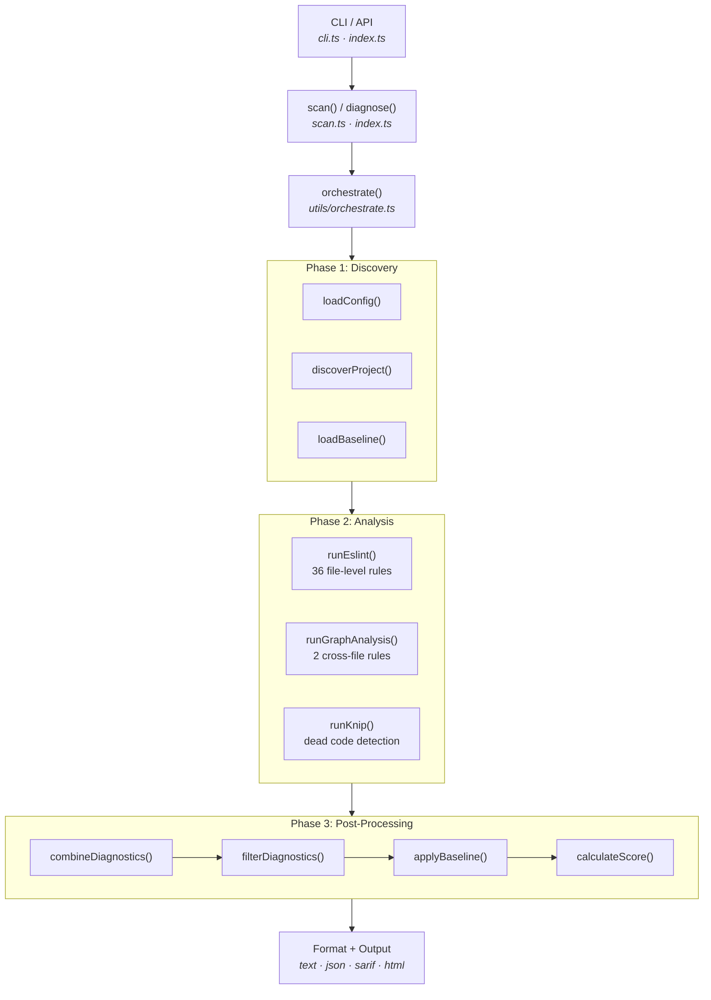

---

## Project Structure

Bluebird is organized as a **pnpm monorepo** with the core package living under `packages/bluebird/`:

```
bluebird/
├── package.json                    # Root monorepo config (pnpm workspaces)
├── tsconfig.json                   # Base TypeScript config (ES2022, strict)
├── pnpm-workspace.yaml             # Workspace definition
├── README.md                       # User-facing documentation
├── SECURITY.md                     # Security policy
├── docs/
│   ├── MANUAL.md                   # User manual
│   └── ARCHITECTURE.md             # This file
└── packages/
    └── bluebird/                   # Core package: bluebird-nestjs
        ├── package.json            # Package config, bin, exports
        ├── tsconfig.json           # Extends root, outputs to dist/
        ├── tsdown.config.ts        # Build config (3 entry points)
        ├── bluebird.schema.json    # JSON Schema for bluebird.config.json
        ├── src/
        │   ├── cli.ts              # CLI entry point (Commander)
        │   ├── index.ts            # Programmatic API entry point
        │   ├── scan.ts             # Interactive scan orchestration
        │   ├── watch.ts            # Watch mode (chokidar)
        │   ├── types.ts            # Core type definitions
        │   ├── constants.ts        # Score/penalty constants
        │   ├── eslint-plugin.ts    # ESLint flat config plugin
        │   ├── rules/
        │   │   ├── index.ts        # Rule registry (38 rules)
        │   │   ├── checkers.ts     # Checker function registry
        │   │   ├── ast-helpers.ts  # TypeScript AST utilities
        │   │   ├── architecture.ts # Architecture rules
        │   │   ├── security.ts     # Security rules
        │   │   ├── correctness.ts  # Correctness rules
        │   │   ├── api-design.ts   # API design rules
        │   │   ├── performance.ts  # Performance rules
        │   │   ├── database.ts     # Database rules
        │   │   ├── testing.ts      # Testing rules
        │   │   └── graph-rules.ts  # Cross-file graph rules
        │   └── utils/
        │       ├── orchestrate.ts       # Central orchestrator
        │       ├── run-eslint.ts        # Lint pass runner
        │       ├── run-graph-analysis.ts # Graph pass runner
        │       ├── run-knip.ts          # Dead code pass runner (knip)
        │       ├── discover-project.ts  # Project metadata detection
        │       ├── load-config.ts       # Config file loader
        │       ├── filter-diagnostics.ts # Ignore/waiver filtering
        │       ├── calculate-score.ts   # Health score algorithm
        │       ├── combine-diagnostics.ts # Merge & sort diagnostics
        │       ├── baseline.ts          # Baseline snapshot system
        │       ├── parse-disable-comments.ts # Inline disable parser
        │       ├── diff-files.ts        # Git diff integration
        │       ├── source-files.ts      # TypeScript file loader
        │       ├── format-text.ts       # Text output formatter
        │       ├── format-json.ts       # JSON output formatter
        │       ├── format-sarif.ts      # SARIF output formatter
        │       ├── format-html.ts       # HTML report formatter
        │       ├── init-config.ts       # Interactive config wizard
        │       ├── open-browser.ts      # Browser launch helper
        │       ├── version.ts           # Version resolver
        │       ├── is-test-file.ts      # Test file detection
        │       └── is-migration-file.ts # Migration file detection
        └── tests/                  # Vitest test suite
```

---

## Entry Points

Bluebird exposes three distinct entry points, each built separately:

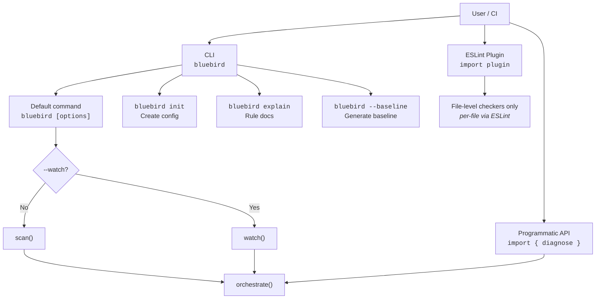

| Entry Point | File | Export Path | Purpose |
|---|---|---|---|
| **CLI** | `src/cli.ts` | `bin.bluebird` → `dist/cli.js` | Command-line interface |
| **Programmatic API** | `src/index.ts` | `"."` → `dist/index.js` | Library usage from Node.js |
| **ESLint Plugin** | `src/eslint-plugin.ts` | `"./eslint-plugin"` → `dist/eslint-plugin.js` | Integration with ESLint flat config |

### CLI Commands

The CLI is built with [Commander](https://github.com/tj/commander.js) and offers:

**Default command** — Run analysis:

```
bluebird [options]
```

| Flag | Description |
|---|---|
| `-v, --verbose` | Show all diagnostics (not just summary) |
| `-q, --quiet` | Suppress output, only set exit code |
| `-p, --project <path>` | Project root directory (default: cwd) |
| `-s, --score` | Output only the numeric health score |
| `--diff <branch>` | Only analyze files changed vs. a git branch |
| `--format text\|json\|sarif\|html` | Output format (default: text) |
| `--fail-on error\|warning\|none` | Exit code threshold (default: error) |
| `--fail-on-score <n>` | Exit code 1 when score < n |
| `--no-lint` | Skip the lint analysis pass |
| `--no-dead-code` | Skip the dead code analysis pass |
| `--no-graph-analysis` | Skip the graph analysis pass |
| `--include-heuristic` | Include heuristic-confidence rules |
| `--baseline` | Generate a baseline snapshot |
| `--update-baseline` | Update existing baseline |
| `-w, --watch` | Watch mode: re-run on file changes |
| `--fast` | Run analysis passes in parallel |
| `-o, --open` | Open HTML report in browser |

**`init`** — Create configuration file:

```
bluebird init [--force] [--yes] [--heuristic] [--skip-graph]
              [--ignore-rules <rules>] [--ignore-files <patterns>]
```

**`explain`** — Rule documentation:

```
bluebird explain [rule]       # Show details for a specific rule
bluebird explain --list       # List all rules
bluebird explain -c security  # List rules in a category
```

---

## End-to-End Data Flow

Here is the complete journey from CLI invocation to output:

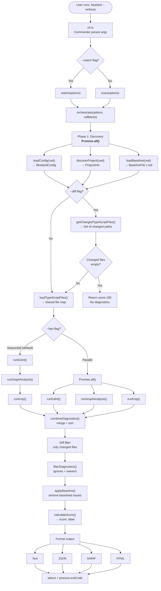

---

## Phase 1: Discovery

Discovery runs three tasks **in parallel** using `Promise.all()` to minimize startup latency.

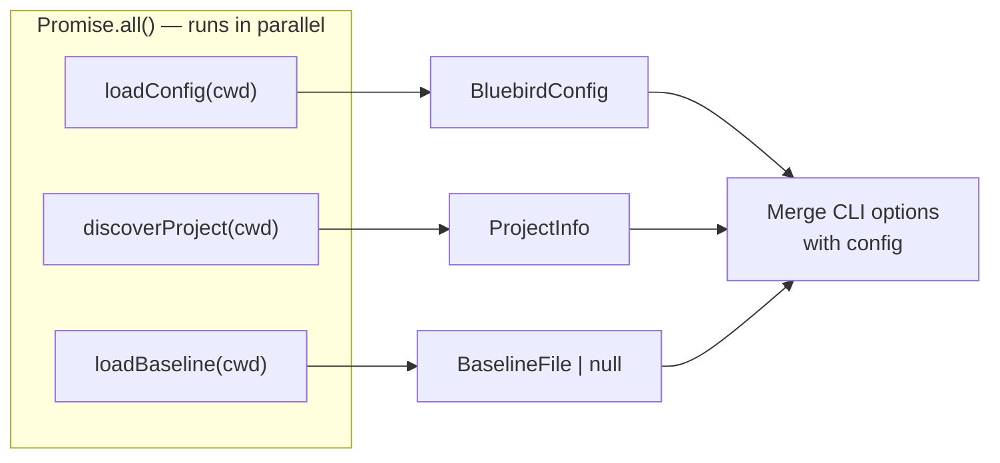

### Configuration Loading

**File:** `utils/load-config.ts`

Configuration is resolved from the following sources in priority order:

1. `bluebird.config.json` in the project root
2. `"bluebird"` key in `package.json`
3. Defaults (all passes enabled, no ignores)

The config shape (`BluebirdConfig`):

```typescript
interface BluebirdConfig {
  ignore?: {
    rules?: string[];    // e.g. ["bluebird/no-console-log"]
    files?: string[];    // glob patterns, e.g. ["src/legacy/**"]
  };
  lint?: boolean;
  deadCode?: boolean;
  graphAnalysis?: boolean;
  verbose?: boolean;
  diff?: string;
  includeHeuristic?: boolean;
  waivers?: Waiver[];   // { rule, file, reason }
}
```

A JSON Schema (`bluebird.schema.json`) provides IDE autocompletion for the config file.

### Project Discovery

**File:** `utils/discover-project.ts`

This step introspects the project to build a `ProjectInfo` object. Detection runs in two phases:

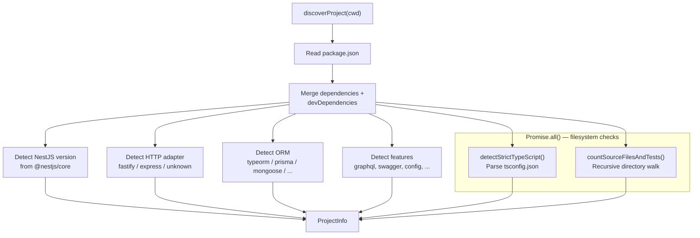

**From `package.json`** (synchronous after file read):

| Detection | Method |
|---|---|
| **NestJS version** | Parse `@nestjs/core` version from dependencies |
| **HTTP adapter** | Check for `@nestjs/platform-fastify` or `@nestjs/platform-express` |
| **ORM** | Priority scan of `typeorm`, `prisma`, `mongoose`, `sequelize`, `mikroorm`, `drizzle` |
| **Features** | Boolean detection of 9 feature packages |

**Feature detection table:**

| Feature | Detected Package(s) |
|---|---|
| `graphql` | `@nestjs/graphql` |
| `websockets` | `@nestjs/websockets` |
| `microservices` | `@nestjs/microservices` |
| `cqrs` | `@nestjs/cqrs` |
| `swagger` | `@nestjs/swagger` |
| `bull` | `@nestjs/bull`, `@nestjs/bullmq` |
| `config` | `@nestjs/config` |
| `throttler` | `@nestjs/throttler` |
| `cache` | `@nestjs/cache-manager`, `cache-manager` |

**From filesystem** (run in parallel with `Promise.all`):

| Detection | Method |
|---|---|
| **TypeScript strict mode** | `ts.findConfigFile()` + `ts.parseJsonConfigFileContent()` → check `strict === true` |
| **Source file count** | Recursive directory walk, counting `.ts` files (excluding `.d.ts`) |
| **Test presence** | Check for `.spec.ts` / `.test.ts` files during the directory walk |

Directories excluded from the file walk: `node_modules`, `dist`, `.git`, `coverage`, `.turbo`, `.next`, `.nx`, `build`, `out`.

### Baseline Loading

**File:** `utils/baseline.ts`

Loads `.bluebird-baseline.json` if present. The baseline is a snapshot of known diagnostics that acts as a "grandfather clause" — diagnostics matching the baseline are excluded from the final output. This allows teams to adopt Bluebird incrementally without being overwhelmed by pre-existing issues.

```typescript
interface BaselineFile {
  version: 1;
  createdAt: string;
  entries: BaselineEntry[];   // { rule, filePath, line }
}
```

Matching uses a composite key: `rule::filePath::line`.

---

## Phase 2: Analysis

Bluebird runs three independent analysis passes. Each pass produces its own `Diagnostic[]` and `RunnerWarning[]`. Passes share a pre-loaded file map to avoid redundant disk I/O.

### Shared File Loading

**File:** `utils/source-files.ts`

Before the lint and graph passes run, `loadTypeScriptFiles()` reads all TypeScript source files into memory as a `Map<string, string>` (relative path → source text). This shared data structure is passed to both runners, ensuring each file is read from disk exactly once.

Files are filtered to include `.ts`, `.mts`, `.cts` extensions while excluding:
- Declaration files (`.d.ts`, `.d.mts`, `.d.cts`)
- Files in ignored directories (`node_modules`, `dist`, `.git`, etc.)

### Lint Pass (File-Level Analysis)

**File:** `utils/run-eslint.ts`

The lint pass is the primary analysis engine. It runs **36 file-level checker functions** against each TypeScript source file individually.

**Execution flow:**

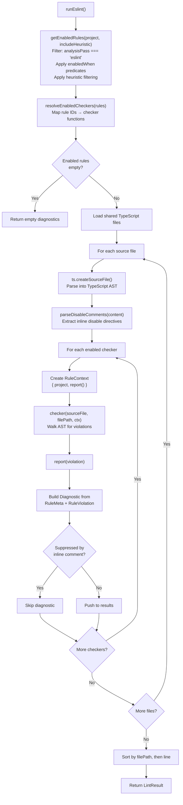

Each checker function receives:
- `sourceFile` — The parsed TypeScript `ts.SourceFile` AST
- `filePath` — Relative path for diagnostic messages
- `ctx` — A `RuleContext` with `project` metadata and a `report()` callback

The `report()` callback in the context constructs a full `Diagnostic` by merging the `RuleMeta` (severity, category, confidence) with the `RuleViolation` (file, line, message), then checks it against inline disable comments before adding it to the results.

### Graph Pass (Cross-File Analysis)

**File:** `utils/run-graph-analysis.ts`

The graph pass handles rules that require visibility across multiple files simultaneously. It currently powers **2 rules**:

| Rule | What It Detects |
|---|---|
| `no-circular-dependency` | Circular module import chains |
| `no-duplicate-route` | Duplicate HTTP method + path combinations across controllers |

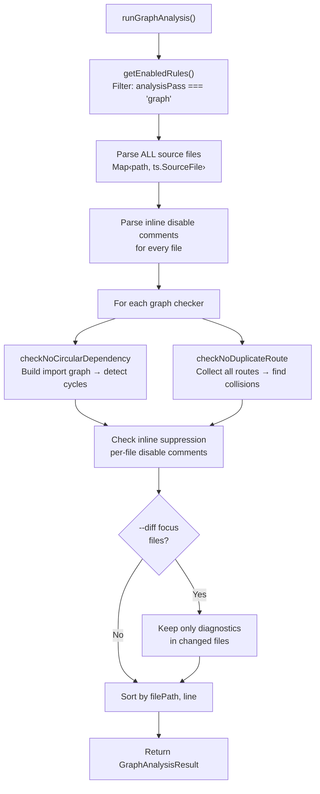

The key difference from the lint pass is that graph checkers receive the **entire** map of parsed source files, enabling them to build dependency graphs, route tables, and other cross-cutting analyses.

### Dead Code Pass (Knip Integration)

**File:** `utils/run-knip.ts`

The dead code pass delegates to [Knip](https://knip.dev/), a specialized tool for finding unused files, exports, types, and duplicates. Bluebird wraps Knip's programmatic API (`knip.main` and `knip/session.createOptions`) and translates its output into Bluebird diagnostics.

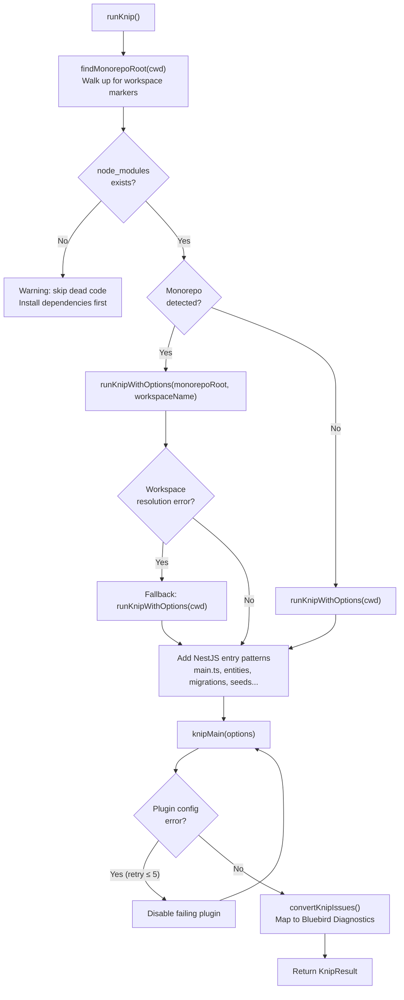

**Knip issue types mapped to Bluebird diagnostics:**

| Knip Issue | Bluebird Rule | Message |
|---|---|---|
| `files` | `knip/files` | Unused file |
| `exports` | `knip/exports` | Unused export |
| `types` | `knip/types` | Unused exported type |
| `duplicates` | `knip/duplicates` | Duplicate export |

**NestJS-specific enhancements:**

Bluebird adds NestJS-aware entry point patterns to Knip's config to prevent false positives. These include:

- Application bootstraps (`main.ts`, `instrumentation.ts`)
- TypeORM CLI files (`data-source.ts`, `ormconfig.ts`)
- Database migrations and seeds (`**/migrations/**`, `**/seeds/**`)
- Test infrastructure (`test/mocks/**`, `test/factories/**`)
- Dynamically loaded files (`**/entities/**`, `**/subscribers/**`)

**Monorepo support:**

For projects in a monorepo, Bluebird:
1. Detects the monorepo root by walking up the directory tree looking for markers (`pnpm-workspace.yaml`, `lerna.json`, `nx.json`, `rush.json`)
2. Attempts to run Knip from the monorepo root with workspace scoping
3. Falls back to running from the workspace directory if workspace resolution fails

**Retry logic:**

Plugin config-loading errors are retried up to 5 times (`MAX_KNIP_RETRIES`). On each retry, the failing plugin is disabled. This handles cases where a project has config files for tools that aren't fully configured in the Knip environment.

**Prerequisite check:**

If `node_modules` is not found (neither in the project nor the monorepo root), the dead code pass is skipped entirely with a warning suggesting the user install dependencies first.

### Sequential vs Parallel Execution

By default, passes run **sequentially** with per-pass progress spinners:

```
✓ Lint analysis     2.1s  (14 diagnostics)
✓ Graph analysis    0.3s  (0 diagnostics)
✓ Dead code analysis 4.2s  (3 diagnostics)
```

With `--fast`, passes run **in parallel** via `Promise.all()` with a single combined spinner:

```
✓ Analysis complete  4.3s  (17 diagnostics)
```

Parallel mode trades per-pass progress feedback for faster total execution time, since the three passes are independent.

---

## Phase 3: Post-Processing

After all analysis passes complete, diagnostics go through a post-processing pipeline.

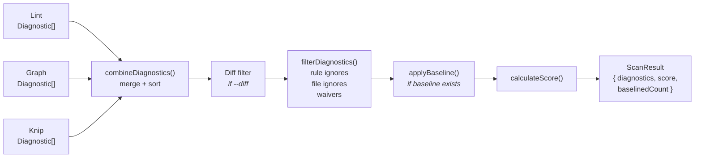

### Diagnostic Combination

**File:** `utils/combine-diagnostics.ts`

All diagnostic arrays from the three passes are merged into a single sorted array. Sorting is by file path (lexicographic), then by line number (numeric).

### Diff Filtering

When `--diff <branch>` is used, only diagnostics whose `filePath` appears in the set of changed files (relative to the specified git branch) are retained. This enables PR-scoped analysis — only flagging issues in code the developer actually touched.

### Config-Based Filtering

**File:** `utils/filter-diagnostics.ts`

Diagnostics are filtered through three layers:

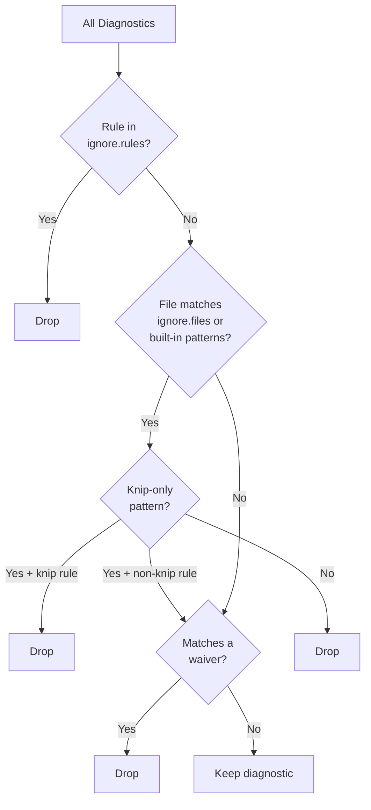

1. **Rule ignores** — `config.ignore.rules` removes all diagnostics for specific rule IDs
2. **File ignores** — `config.ignore.files` + built-in config file patterns remove diagnostics from matching paths
3. **Waivers** — `config.waivers[]` entries with `{ rule, file, reason }` remove specific rule+file combinations

**Built-in ignored patterns:**

A comprehensive list of tool configuration files is always excluded (ESLint configs, Jest configs, Prettier configs, Webpack configs, etc.) since these files don't contain application logic. Knip-specific patterns (seeds, migrations, Cypress support) are only applied to `knip/*` rules, not to other analysis rules.

The glob matcher supports `**` (any path segments), `*` (any characters in a segment), and `?` (single character).

### Baseline Application

**File:** `utils/baseline.ts`

If a `.bluebird-baseline.json` exists and `useBaseline` is not disabled, diagnostics matching baseline entries are removed. The match key is `rule::filePath::line`. The count of suppressed diagnostics is tracked as `baselinedCount` in the result.

### Score Calculation

**File:** `utils/calculate-score.ts`

The health score uses a **hybrid penalty system** combining per-rule and per-instance penalties:

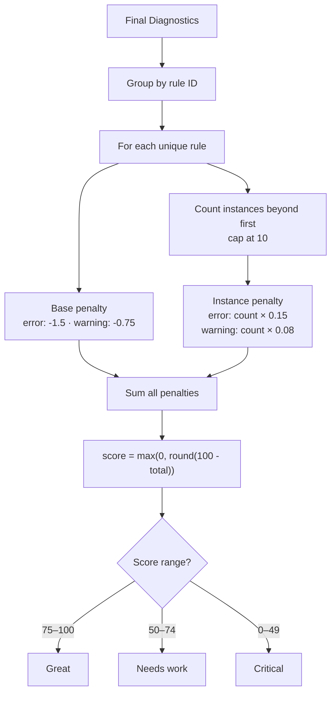

```
score = max(0, round(100 - rulePenalties - instancePenalties))
```

**Per unique rule (base penalty):**

| Severity | Penalty |
|---|---|
| `error` | -1.5 points |
| `warning` | -0.75 points |

**Per additional instance (diminishing cost, capped at 10 extra instances):**

| Severity | Penalty per instance |
|---|---|
| `error` | -0.15 points |
| `warning` | -0.08 points |

This means a rule firing once costs its base penalty. The same rule hitting 50 files costs more than hitting 2 files, but not catastrophically more — the instance penalty is capped at 10 additional occurrences beyond the first.

**Score labels:**

| Range | Label |
|---|---|
| 75–100 | Great |
| 50–74 | Needs work |
| 0–49 | Critical |

**Constants (from `constants.ts`):**

```typescript
SCORE_MAX = 100
PENALTY_ERROR = 1.5
PENALTY_WARNING = 0.75
INSTANCE_PENALTY_ERROR = 0.15
INSTANCE_PENALTY_WARNING = 0.08
INSTANCE_CAP = 10
GOD_CONTROLLER_ROUTE_THRESHOLD = 10
GOD_SERVICE_LINE_THRESHOLD = 400
GOD_MODULE_PROVIDER_THRESHOLD = 15
MAX_KNIP_RETRIES = 5
```

---

## Rule System

### Rule Metadata

Every rule is defined as a `RuleMeta` object in the frozen rule registry (`rules/index.ts`):

```typescript
interface RuleMeta {
  id: string;                                    // e.g. "no-hardcoded-dependency"
  category: RuleCategory;                        // e.g. "architecture"
  severity: 'error' | 'warning';                 // Determines penalty weight
  confidence: 'deterministic' | 'heuristic';     // Controls opt-in behavior
  description: string;                           // Human-readable summary
  help: string;                                  // Actionable fix guidance
  analysisPass: 'eslint' | 'graph' | 'knip';    // Which pass runs this rule
  enabledWhen?: (project: ProjectInfo) => boolean; // Feature gate
}
```

The rule registry is deeply frozen (`Object.freeze`) to prevent mutation. It contains **38 rules** organized across **10 categories**.

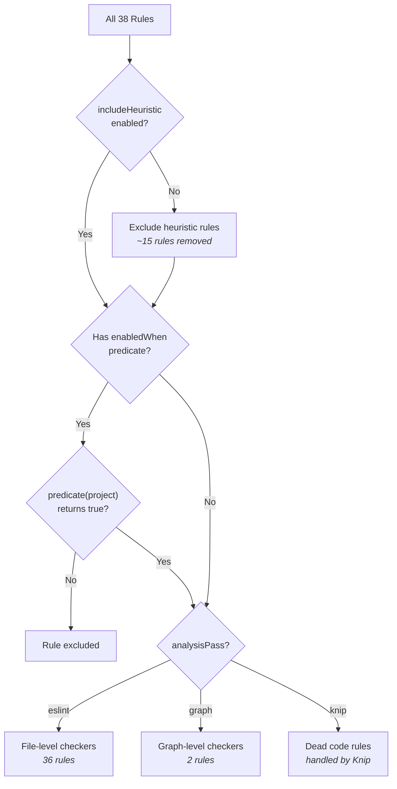

### Rule Categories

| Category | Count | Scope |
|---|---|---|
| `architecture` | 4 | Structural patterns (DI, god objects, cycles) |
| `security` | 9 | Secrets, validation, SQL injection, headers |
| `correctness` | 10 | NestJS decorator correctness, lifecycle hooks |
| `api-design` | 5 | Swagger docs, HTTP status, pagination, DTOs |
| `performance` | 4 | Blocking I/O, sync crypto, N+1 queries |
| `database` | 2 | Missing indexes, missing migrations |
| `testing` | 1 | Test coverage gaps |
| `graphql` | 1 | Resolver decorator completeness |
| `microservices` | 1 | Message pattern decorators |
| `websockets` | 1 | WebSocket gateway decorators |

### Rule Confidence Tiers

Rules are classified into two confidence tiers:

- **Deterministic** (default, always enabled) — Rules that can be statically proven with high accuracy. Low false-positive rate.
- **Heuristic** (opt-in via `--include-heuristic`) — Rules that rely on conventions or patterns that may not apply to every project. Higher false-positive rate.

Heuristic rules are excluded by default and only included when `--include-heuristic` is passed or `includeHeuristic: true` is set in config.

### Feature-Gated Rules

Some rules only make sense when specific NestJS packages are installed. These rules have an `enabledWhen` predicate that checks `ProjectInfo.features`:

| Rule | Enabled When |
|---|---|
| `missing-swagger-decorators` | `project.features.swagger === true` |
| `missing-resolver-decorator` | `project.features.graphql === true` |
| `missing-message-pattern` | `project.features.microservices === true` |
| `missing-websocket-decorator` | `project.features.websockets === true` |
| `missing-config-validation` | `project.features.config === true` |

### File-Level Checkers

**File:** `rules/checkers.ts`

The `fileCheckers` map connects rule IDs to their checker functions. Each checker has the signature:

```typescript
type FileRuleChecker = (
  sourceFile: ts.SourceFile,
  filePath: string,
  ctx: RuleContext
) => void;
```

There are **36 file-level checkers** organized across rule files:

| File | Checkers |
|---|---|
| `architecture.ts` | `checkNoHardcodedDependency`, `checkNoGodController`, `checkNoGodService` |
| `security.ts` | `checkNoHardcodedSecrets`, `checkMissingValidationPipe`, `checkNoAnyInDto`, `checkNoRawSql`, `checkMissingClassValidator`, `checkMissingCsrfProtection`, `checkMissingRateLimiting`, `checkMissingGlobalGuard`, `checkMissingHelmet` |
| `correctness.ts` | `checkMissingInjectable`, `checkLifecycleHookInterface`, `checkNoConstructorSideEffects`, `checkNoNestedControllerDecorator`, `checkNoConsoleLog`, `checkNoProcessEnvDirect`, `checkMissingExceptionFilter`, `checkMissingParsePipe`, `checkMissingResolverDecorator`, `checkMissingMessagePattern`, `checkMissingWebsocketDecorator`, `checkMissingConfigValidation` |
| `api-design.ts` | `checkMissingSwaggerDecorators`, `checkNoEntityAsResponse`, `checkNoInconsistentHttpStatus`, `checkPreferPagination`, `checkNoGenericException` |
| `performance.ts` | `checkNoSyncFsOperations`, `checkNoBlockingCrypto`, `checkMissingCaching`, `checkNoNPlusOne` |
| `database.ts` | `checkMissingIndexes`, `checkMissingMigration` |
| `testing.ts` | `checkLowTestCoverage` |

**AST Helpers** (`rules/ast-helpers.ts`) provide shared utilities for rule implementations:

- `getDecorators()`, `getDecoratorName()`, `hasDecorator()`, `findDecorator()` — Decorator inspection
- `getLine()`, `getColumn()` — Position extraction
- `walk()` — AST traversal
- `HTTP_METHOD_DECORATORS`, `NEST_CLASS_DECORATORS` — Known decorator sets
- `collectTypeReferenceNames()`, `getDecoratorStringArg()`, `resolveCallName()` — Type and expression utilities

### Graph-Level Checkers

The `graphCheckers` map contains **2 cross-file checkers**:

```typescript
type GraphRuleChecker = (
  sourceFiles: ReadonlyMap<string, ts.SourceFile>,
  ctx: RuleContext
) => void;
```

| Rule | Checker | Analysis |
|---|---|---|
| `no-circular-dependency` | `checkNoCircularDependency` | Builds module dependency graph from imports, detects cycles |
| `no-duplicate-route` | `checkNoDuplicateRoute` | Extracts route paths + HTTP methods from all controllers, finds duplicates |

### Complete Rule Reference

#### Architecture (4 rules)

| Rule | Severity | Confidence | Description |
|---|---|---|---|
| `no-hardcoded-dependency` | error | deterministic | Direct instantiation (`new ServiceClass()`) instead of DI |
| `no-god-controller` | warning | deterministic | Controller exceeds 10 route handlers |
| `no-god-service` | warning | deterministic | Service exceeds 400 lines |
| `no-circular-dependency` | error | deterministic | Circular module import chain detected |

#### Security (9 rules)

| Rule | Severity | Confidence | Description |
|---|---|---|---|
| `no-hardcoded-secrets` | error | deterministic | Hardcoded secret or credential in source |
| `missing-validation-pipe` | warning | deterministic | No global ValidationPipe configured |
| `no-any-in-dto` | warning | deterministic | DTO class or property typed as `any` |
| `no-raw-sql` | error | deterministic | Raw SQL string template without parameterization |
| `missing-class-validator` | warning | deterministic | DTO property without validation decorators |
| `missing-csrf-protection` | warning | heuristic | No CSRF protection middleware |
| `missing-rate-limiting` | warning | heuristic | No rate limiting configured |
| `missing-global-guard` | warning | heuristic | No global auth guard |
| `missing-helmet` | warning | heuristic | No helmet middleware for security headers |

#### Correctness (10 rules)

| Rule | Severity | Confidence | Description |
|---|---|---|---|
| `missing-injectable` | error | deterministic | Provider class without `@Injectable()` |
| `lifecycle-hook-interface` | warning | deterministic | Lifecycle method without corresponding interface |
| `no-duplicate-route` | error | deterministic | Duplicate HTTP method + path across handlers |
| `no-constructor-side-effects` | warning | deterministic | Side effects in constructor body |
| `no-nested-controller-decorator` | error | deterministic | `@Controller()` on non-top-level class |
| `no-console-log` | warning | deterministic | Direct `console.log` instead of NestJS Logger |
| `no-process-env-direct` | warning | deterministic | Direct `process.env` instead of ConfigService |
| `missing-exception-filter` | warning | heuristic | No global exception filter configured |
| `missing-parse-pipe` | warning | deterministic | Route parameter without parsing pipe |
| `missing-config-validation` | warning | heuristic | ConfigModule without validation schema |

#### API Design (5 rules)

| Rule | Severity | Confidence | Description |
|---|---|---|---|
| `missing-swagger-decorators` | warning | deterministic | Endpoint missing `@ApiOperation`/`@ApiResponse` |
| `no-entity-as-response` | warning | deterministic | ORM entity returned directly from controller |
| `no-inconsistent-http-status` | warning | heuristic | HTTP status mismatched with method semantics |
| `prefer-pagination` | warning | heuristic | Unbounded list endpoint without pagination |
| `no-generic-exception` | warning | deterministic | Throwing generic `Error` instead of NestJS `HttpException` |

#### Performance (4 rules)

| Rule | Severity | Confidence | Description |
|---|---|---|---|
| `no-sync-fs-operations` | warning | deterministic | Synchronous filesystem operations |
| `no-blocking-crypto` | warning | deterministic | Blocking crypto operations |
| `missing-caching` | warning | heuristic | No caching strategy detected |
| `no-n-plus-one` | warning | heuristic | Potential N+1 query pattern |

#### Database (2 rules)

| Rule | Severity | Confidence | Description |
|---|---|---|---|
| `missing-indexes` | warning | heuristic | Query patterns without matching indexes |
| `missing-migration` | warning | heuristic | Schema changes without migration files |

#### Testing (1 rule)

| Rule | Severity | Confidence | Description |
|---|---|---|---|
| `low-test-coverage` | warning | heuristic | Missing spec files for providers/controllers |

#### Feature-Gated Rules (3 rules)

| Rule | Category | Enabled When |
|---|---|---|
| `missing-resolver-decorator` | graphql | `@nestjs/graphql` installed |
| `missing-message-pattern` | microservices | `@nestjs/microservices` installed |
| `missing-websocket-decorator` | websockets | `@nestjs/websockets` installed |

---

## Inline Disable System

**File:** `utils/parse-disable-comments.ts`

Bluebird supports inline comments to suppress diagnostics, similar to ESLint's disable comments:

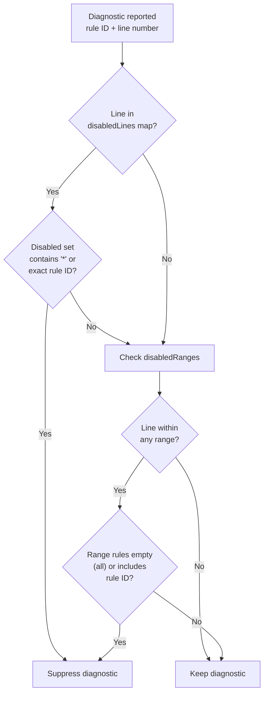

**Single line:**

```typescript
// bluebird-disable-next-line
doSomething();

// bluebird-disable-next-line no-console-log
console.log('debug');

// bluebird-disable-next-line no-console-log, no-process-env-direct
console.log(process.env.DEBUG);
```

**Range:**

```typescript
// bluebird-disable no-console-log
console.log('start');
console.log('middle');
// bluebird-enable no-console-log

// bluebird-disable
// Everything here is ignored
// bluebird-enable
```

Both `//` and `/* */` comment styles are supported. Rule IDs can be specified with or without the `bluebird/` prefix.

The parser produces a `ParsedDisableComments` structure with:
- `disabledLines` — `Map<lineNumber, Set<ruleId>>` for next-line disables
- `disabledRanges` — `DisabledRange[]` for block disables with start/end lines

Suppression is checked via `isDiagnosticSuppressed()` before each diagnostic is added to the result.

---

## Output and Reporting

Bluebird supports four output formats, selected via `--format`:

### Text Formatter

**File:** `utils/format-text.ts`

The default human-readable output with:
- ASCII art logo
- Score box with color-coded score and label
- Error/warning count summary
- Diagnostics grouped by category
- Top issues with file locations
- Verbose mode shows all individual diagnostics

Interactive text mode uses [ora](https://github.com/sindresorhus/ora) spinners for progress feedback during analysis.

### JSON Formatter

**File:** `utils/format-json.ts`

Machine-readable JSON output containing:

```typescript
interface JsonOutput {
  score: number;
  label: string;
  errors: number;
  warnings: number;
  project: ProjectInfo;
  diagnostics: Diagnostic[];
  warnings: RunnerWarning[];
}
```

### SARIF Formatter

**File:** `utils/format-sarif.ts`

Outputs [SARIF 2.1.0](https://sarifweb.azurewebsites.net/) (Static Analysis Results Interchange Format) for integration with GitHub Code Scanning, Azure DevOps, and other SARIF-compatible tools.

### HTML Formatter

**File:** `utils/format-html.ts`

Generates a self-contained HTML report with:
- Dark theme design
- Score gauge visualization
- Charts showing diagnostic distribution
- Collapsible diagnostic sections
- Can be opened in browser with `--open`

---

## Watch Mode

**File:** `watch.ts`

Watch mode continuously monitors the project for changes and re-runs analysis automatically.

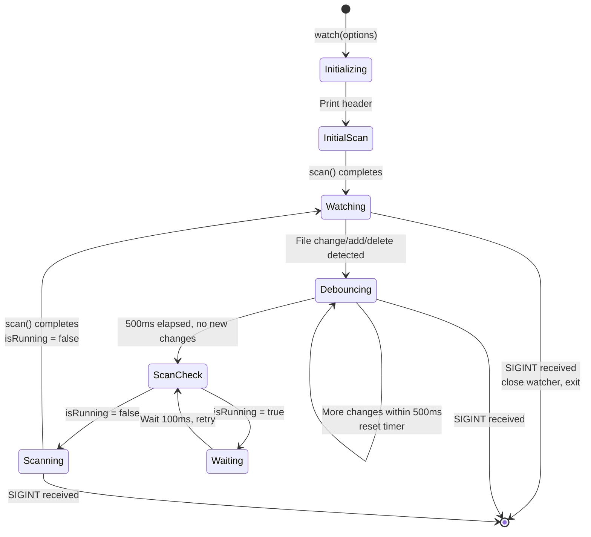

**Watched patterns:** `**/*.ts`, `**/*.tsx`

**Ignored directories:** `node_modules`, `dist`, `build`, `.git`, `coverage`

**Debounce:** 500ms after the last change event (prevents rapid re-runs during saves)

**Concurrency guard:** If a scan is already running when changes are detected, the new scan is deferred until the current one completes.

---

## ESLint Plugin

**File:** `eslint-plugin.ts`

Bluebird's file-level rules can also run as an ESLint plugin via `bluebird-nestjs/eslint-plugin`. This allows teams to integrate Bluebird rules into their existing ESLint pipeline.

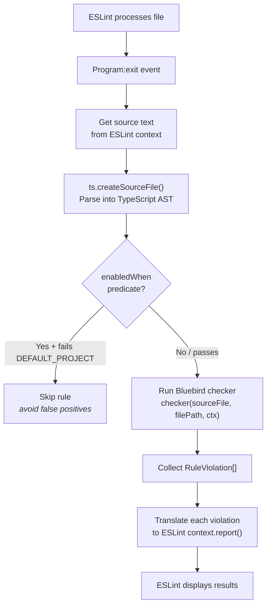

**How it works:**

1. Each file-level checker is wrapped in an ESLint rule module (`wrapChecker()`)
2. The wrapper creates a `Program:exit` handler that:
   - Gets the source text from ESLint's source code API
   - Parses it into a TypeScript AST
   - Runs the Bluebird checker
   - Translates violations into ESLint `context.report()` calls
3. A `recommended` config preset enables all deterministic, non-feature-gated rules

**Limitations:**
- Only file-level rules are available (graph rules require the full file set)
- Feature-gated rules (`enabledWhen`) are disabled by default since the plugin cannot auto-detect project features
- Uses a fallback `DEFAULT_PROJECT` with all features set to `false`

**Usage:**

```javascript
// eslint.config.js
import bluebird from 'bluebird-nestjs/eslint-plugin';

export default [
  bluebird.configs.recommended,
];
```

---

## Type System and Data Models

All core types are defined in `types.ts`:

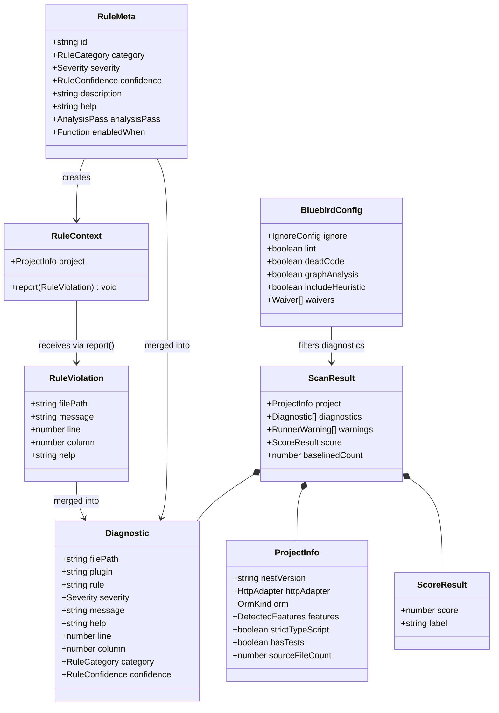

### Diagnostic

The fundamental output unit — a single issue found in the codebase:

```typescript
interface Diagnostic {
  filePath: string;             // Relative path to the file
  plugin: string;               // "bluebird" or "knip"
  rule: string;                 // e.g. "bluebird/no-console-log" or "knip/files"
  severity: 'error' | 'warning';
  message: string;              // Human-readable issue description
  help?: string;                // Actionable fix guidance
  line?: number;                // 1-indexed line number
  column?: number;              // 1-indexed column number
  category: RuleCategory;       // e.g. "security", "architecture"
  confidence: RuleConfidence;   // "deterministic" or "heuristic"
  weight?: number;              // Optional custom weight
}
```

### ScanResult

The complete output of an analysis run:

```typescript
interface ScanResult {
  project: ProjectInfo;         // Detected project metadata
  diagnostics: Diagnostic[];    // All diagnostics after filtering
  warnings: RunnerWarning[];    // Non-fatal issues during analysis
  score: ScoreResult;           // { score: number, label: string }
  baselinedCount: number;       // How many diagnostics were suppressed by baseline
}
```

### ProjectInfo

Metadata about the analyzed project:

```typescript
interface ProjectInfo {
  nestVersion: string | null;
  httpAdapter: 'express' | 'fastify' | 'unknown';
  orm: 'typeorm' | 'prisma' | 'mongoose' | 'sequelize' | 'mikroorm' | 'drizzle' | 'none';
  features: DetectedFeatures;   // 9 boolean flags
  strictTypeScript: boolean;
  hasTests: boolean;
  sourceFileCount: number;
}
```

### RuleContext

The interface that checker functions use to report violations:

```typescript
interface RuleContext {
  project: ProjectInfo;
  report(violation: RuleViolation): void;
}

interface RuleViolation {
  filePath: string;
  message: string;
  line?: number;
  column?: number;
  help?: string;
}
```

---

## Build and Packaging

### Build Tool

Bluebird uses [tsdown](https://github.com/nicepkg/tsdown) to produce ESM bundles with TypeScript declarations and source maps.

**Three entry points are built in parallel:**

| Entry | Output | Purpose |
|---|---|---|
| `src/cli.ts` | `dist/cli.js` | CLI binary |
| `src/index.ts` | `dist/index.js` + `.d.ts` | Library API |
| `src/eslint-plugin.ts` | `dist/eslint-plugin.js` + `.d.ts` | ESLint plugin |

### Dependencies

| Package | Purpose |
|---|---|
| `typescript` | AST parsing (core analysis engine) |
| `commander` | CLI argument parsing |
| `chokidar` | File system watching |
| `knip` | Dead code detection |
| `ora` | Terminal spinners |
| `picocolors` | Terminal color output |
| `prompts` | Interactive config wizard |

### Testing

Tests use [Vitest](https://vitest.dev/) with V8 code coverage. Run with:

```bash
pnpm test            # Single run
pnpm test:watch      # Watch mode
pnpm test:coverage   # With coverage report
```

---

## Extension Points

Bluebird is designed with clear extension points for adding new capabilities:

### Adding a New Rule

1. **Define metadata** — Add a `RuleMeta` entry to the `allRules` array in `rules/index.ts`
2. **Implement checker** — Write the checker function in the appropriate category file (`security.ts`, `architecture.ts`, etc.)
3. **Register checker** — Add the mapping in `rules/checkers.ts` (either `fileCheckers` or `graphCheckers`)
4. The rule automatically becomes available in CLI, ESLint plugin, and all output formats

### Adding a New Output Format

1. Create a formatter function in `utils/format-<name>.ts`
2. Add the format to the `OutputFormat` type union in `types.ts`
3. Wire it into `getFormatter()` in `scan.ts`
4. Add the CLI `--format` choice in `cli.ts`

### Adding a New Analysis Pass

1. Create a runner in `utils/run-<name>.ts` returning `{ diagnostics: Diagnostic[], warnings: RunnerWarning[] }`
2. Add the pass to the `AnalysisPass` type union
3. Wire it into the orchestrator's sequential/parallel execution in `utils/orchestrate.ts`
4. Add a CLI flag to enable/disable it

### Extending Project Detection

1. Add detection logic to `utils/discover-project.ts`
2. Extend `ProjectInfo` and/or `DetectedFeatures` in `types.ts`
3. Rules can then use `enabledWhen` predicates to gate on the new feature
